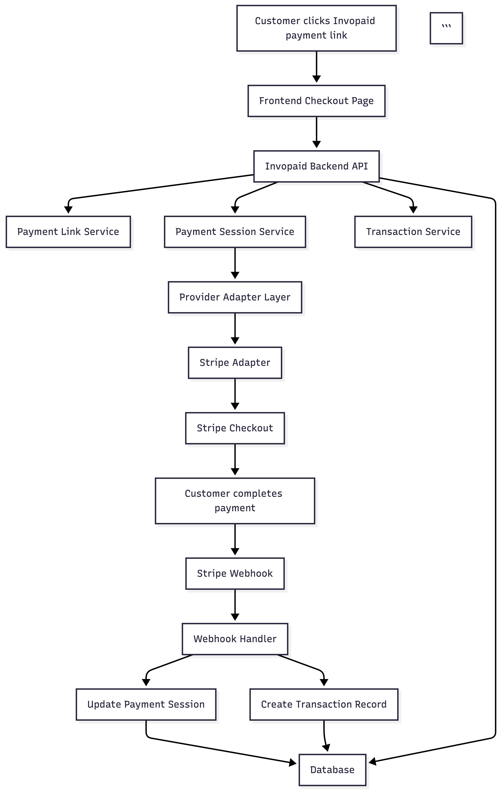
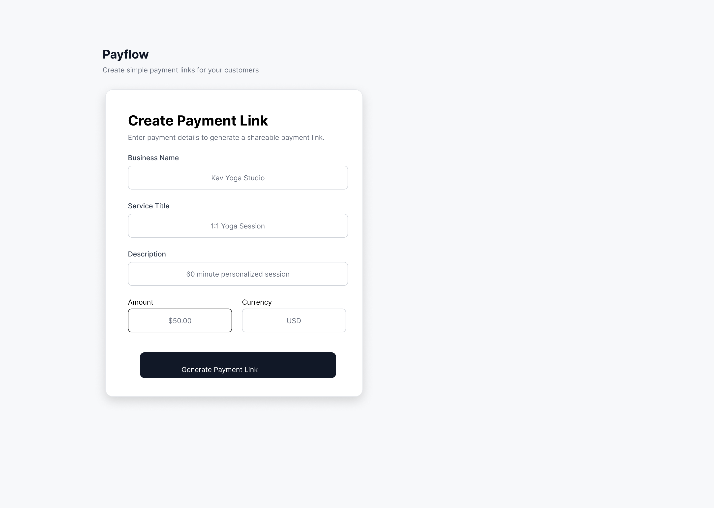
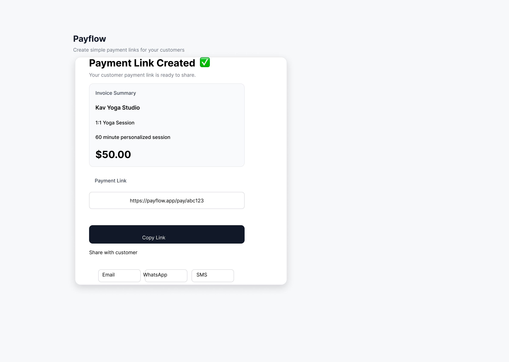
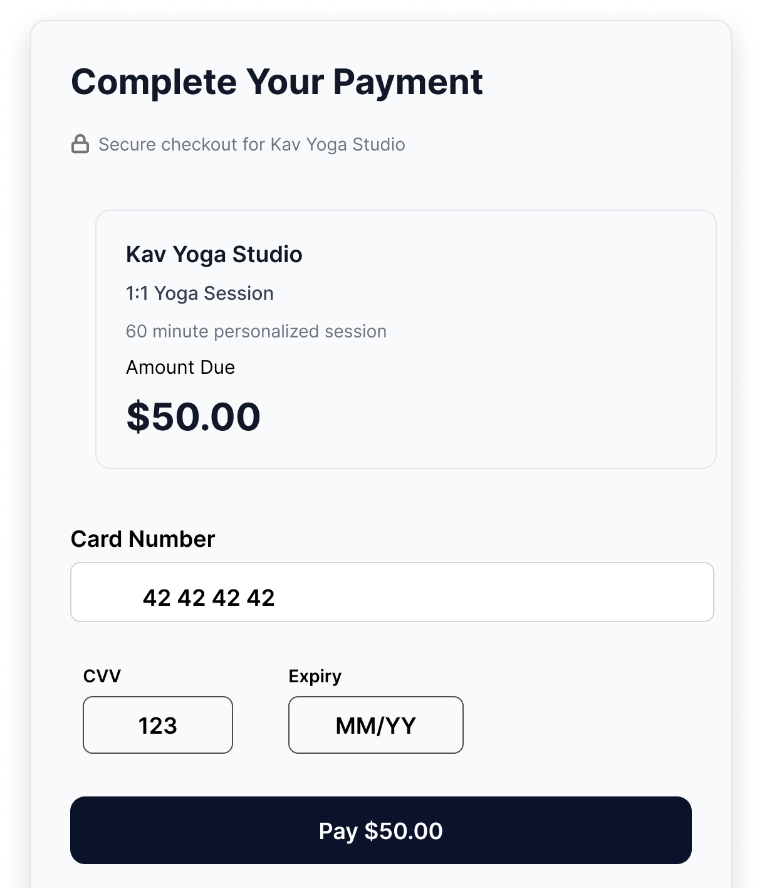
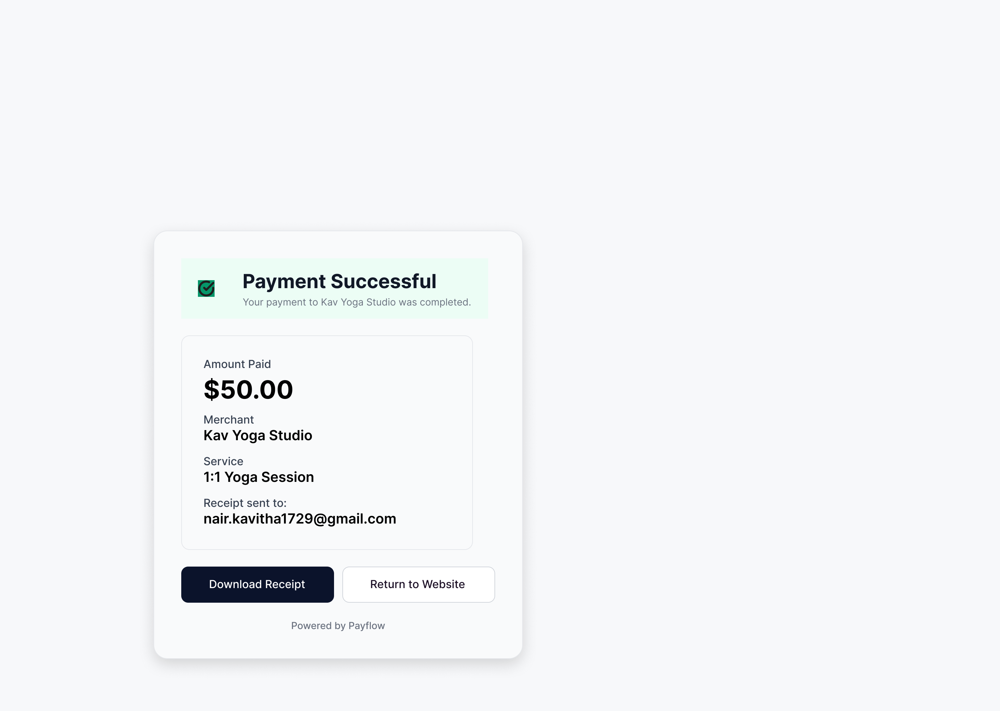

# PayFlow

Simple hosted payments for small businesses.

## What is PayFlow?

PayFlow helps small business owners create a payment link and accept payments without building complex checkout flows.

## Why I’m building this

Small businesses need a fast, simple way to get paid. Existing options are often too heavy, too technical, or too limited.

## MVP

- Merchant onboarding
- Stripe integration
- Payment link generation
- Hosted checkout page
- Basic payment tracking

## Vision

PayFlow starts as a hosted payment link product and evolves into a provider-agnostic payments orchestration layer.

## Architecture

## Features

- Create customer payment links
- Hosted checkout experience
- Invoice/payment summary
- Secure checkout messaging
- Copy/share payment links
- Optional email receipt field
- Mobile-friendly payment flow

This helps recruiters quickly understand scope.

## Project Flow

Merchant creates a payment link
→ Payment link is generated
→ Merchant shares link with customer
→ Customer opens hosted checkout page
→ Customer enters payment details
→ Payment is completed

## Product Flow

1. Merchant creates a payment link
2. Payment link is generated and shared
3. Customer completes secure checkout
4. Customer receives payment confirmation and receipt

## 🎨 Wireframes

### Create Payment Link (Merchant)

This screen allows small business owners to generate a payment link by entering service details.

---

### Payment Link Generated

This screen shows the generated payment link and sharing options for merchants.

## Customer Checkout Page

Users receiving a payment link are taken to a clean hosted checkout experience with:

- Secure payment messaging
- Payment summary
- Card details form
- CVV and expiry validation fields
- Optional email receipt
- Clear primary CTA

### Checkout Experience

### 4. Payment Confirmation

## Project Status

PayFlow is currently in active development.

I'm building this in the open to explore:
- Simple payments for small businesses
- Payment provider abstraction
- Checkout UX and conversion

Feedback is welcome, but the current focus is on a tight MVP (hosted payment links with Stripe).