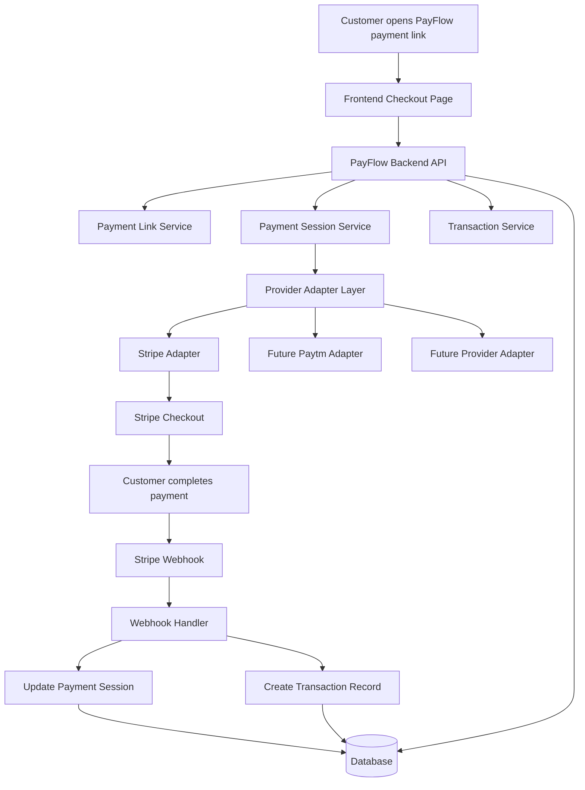

## 1. Purpose

PayFlow is a lightweight hosted payments platform for small businesses. Merchants create payment links, customers pay through a hosted checkout page, and PayFlow tracks payment outcomes through provider webhooks.

The architecture is designed to support a simple MVP first:
- merchant onboarding
- payment link creation
- hosted checkout
- payment confirmation
- basic transaction tracking

At the same time, the system is structured to evolve into a provider-agnostic payments orchestration layer. The system starts with Stripe and is designed to support additional payment providers through a provider adapter layer.

---

## 2. Architecture Goals

### Primary Goals
- Keep the MVP simple and fast to build
- Support secure payment processing
- Reduce merchant setup friction
- Provide clean separation between product logic and payment provider logic

### Secondary Goals
- Enable future support for multiple payment providers
- Allow expansion into embeddable checkout and analytics
- Maintain a clear path to scale

---

## 3. High-Level System Design

PayFlow consists of four main layers:

1. **Frontend**
2. **Backend API**
3. **Payment Adapter Layer**
4. **Database**

### High-Level Flow

```text
Merchant/User
   ↓
Frontend (Dashboard + Payment Pages)
   ↓
Backend API
   ↓
Payment Adapter Layer
   ↓
Stripe (v1)

## 4. Detailed Architecture Diagram



5. Main Components
Frontend Checkout Page

Displays the hosted payment page for the customer.

Responsibilities:

Load payment link details
Show merchant name, amount, and description
Start payment session when customer clicks Pay
Backend API

Coordinates payment link data, payment sessions, and transaction state.

Responsibilities:

Create merchants
Create payment links
Create payment sessions
Expose transaction data
Receive provider webhook events
Payment Link Service

Stores and retrieves hosted payment link details.

Example:

Merchant name
Payment title
Amount
Currency
Status
Payment Session Service

Creates a payment attempt for a customer.

This is separate from a transaction because a customer may start payment but not complete it.

Provider Adapter Layer

Abstracts payment provider-specific logic.

This allows PayFlow to start with Stripe while keeping the system flexible enough to support Paytm or other providers later.

Stripe Adapter

Initial payment provider implementation.

Responsibilities:

Create Stripe Checkout session
Retrieve payment status
Handle refunds later
Webhook Handler

Receives asynchronous updates from Stripe.

Responsibilities:

Verify webhook signature
Match provider session ID
Update payment session status
Create transaction record
Database

Stores core PayFlow records:

Merchants
Payment Links
Payment Sessions
Transactions
6. Key Design Decision

PayFlow separates:

Payment Session = payment attempt
Transaction = final payment outcome

This keeps the system clean because not every payment attempt becomes a successful transaction.

7. Future Expansion

The provider adapter layer allows PayFlow to support:

Paytm
Razorpay
PayPal
Smart routing
Provider fallback
Regional payment methods

---